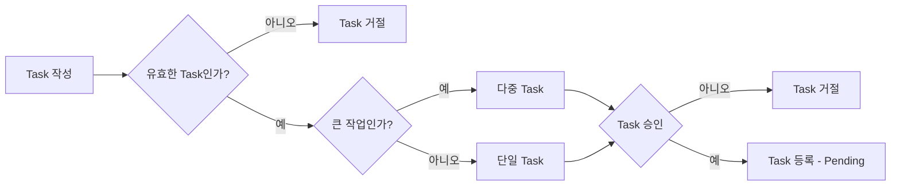

# Agent 오케스트레이션

## 개요

agent 지능이 높아지면서 개발 생산성이 전과는 비교할 수 없을정도로 향상되었다. 하지만 다중 agent들을 효율적으로 다루는 일은 쉽지 않다. 여러 터미널에 클로드 화면을 띄워놓고 개발하는 모습이 익숙하지만 개발 멀티 태스킹으로 작업하는 부분이 개발자의 피로도도 높이고 있다. 그래서 웹단에서 클로드를 orchestrate하는 서비스를 개인적으로 만들어보았다. 이를 통해 24시간 업무 진행, 할당, 개선을 스스로 할 수 있는 서비스를 만들고자 하였다.

|  |
| :---: |
| 4개의 클로드를 사용하고 있는 개발화면 |

## 문제


- **인간 병목**: 에이전트보다 **프로세스 전체에서 가장 느린 축이 사람** — 확인·승인·질문·지시가 끊기지 않아야만 다음으로 넘어가서, **전체 처리량이 인간의 개입 속도·가용 시간에 묶임**
- **상시 운영 한계**: 에이전트를 24시간 돌리기 어렵고, 코드는 생성해 줘도 **테스트·검증은 사람**에게 맡겨지는 경우가 많음
- **컨텍스트·비용**: 사람이 계속 대화를 끌고 가다 보면 **맥락이 길어지고**, 그만큼 **토큰·비용**도 불필요하게 커짐
- **병렬 작업의 충돌**: 여러 agent가 같은 파일을 동시에 수정하면 충돌이 빈번하고, 수동 해결에 시간이 소모됨

## 해결방법

### 1. **인간 병목**
  - **Task Queue 활용**
    - 핵심은 사람이 **에이전트 작업이 끝날 때까지 기다리지 않고** **태스크를 계속 큐에 넣을 수 있다**는 점임. **Task Queue**에 할 일을 미리 쌓아 두면, 에이전트는 순서대로 처리하고 사람은 **완료 대기·중간 확인**에 묶이지 않음.
    

  - **PR 없이 바로 머지**
    - 여기서 **즉시 머지**는 **dev/main에 곧장 넣는다**는 뜻이 아님. **에이전트 전용 브랜치**를 두고, 작업이 끝나면 **AI review**만 거쳐 **그 브랜치에 바로 머지**해 PR·사람 승인 대기에 묶이지 않게 함. **dev·main**(또는 배포 기준 브랜치) 반영은 이후 **사람의 검수**를 거쳐 머지하는 전략을 취함. 
    - 전제는 **에이전트가 사람보다 코드를 더 잘 쓰고 리뷰도 잘한다**는 점 — 에이전트도 오류는 낼 수 있지만 **에이전트가 바로잡을 수 있게** 두고(review 실패 시 **자동 retry**, 한도 초과 시 **failed**). 사람은 **방향·우선순위**와 **최종 병합**만 잡고 일상적 확인·지시는 최소화.
    


### 2. **상시 운영 한계** 
  - 사람은 하루 **8시간** 정도만 일할 수 있어도, 에이전트는 **24시간** 돌릴 수 있음 — 이 차이를 살리려면 **Task Queue**에 **충분한 태스크를 넣어 두는 것**이 핵심. 큐에 일이 쌓여 있으면 사람이 자리를 비워도 에이전트가 이어서 처리해 **24시간 가동**이 가능해짐. 
  - **태스크 우선순위**를 조절해 **사람 검수가 필요한 태스크**는 사람이 있는 시간에 돌리고, **상대적으로 단순한 태스크**는 그 외 시간(야간·자리를 비운 시간 등)에 돌림. 후자에는 **테스트 코드 보강**, **ESLint·코드 품질 점검**, **커버리지** 같은 항목이 포함됨.


### 3. **컨텍스트·비용**
  - **태스크 단위**로 나누고, 태스크마다 **에이전트 세션을 초기화**해 한 채팅 스레드에 맥락을 쌓지 않으며 이전 작업이 다음으로 **끌려오지 않게** 함. **AI 리뷰**도 구현과 **별도 세션**으로 돌려, 작업 중 쌓인 대화 맥락이 **리뷰 단계로 끌려가지 않게** 함. 정의 시 **scope**로 넘길 컨텍스트를 좁히고, **마크다운**에 상태·로그를 남겨 **토큰·대화 비용**을 줄임.
  - **태스크를 지속적으로 모니터링**하며 로그·비용으로 토큰·재시도·중복 작업 등 **새는 지점**을 보고 **절감안을 적용·고안**함.

### 4. **병렬 작업의 충돌** 
  - 병렬로 돌리려면 **충돌이 나지 않는 것**이 가장 중요함. 태스크를 정의할 때 **scope**를 명시하고, **scope이 겹치지 않는 조합**만 **동시에** 돌림. 
  - **git worktree**로 태스크마다 격리된 작업 트리를 쓰고, **scope 충돌 검사**로 같은 파일을 건드리는 태스크는 **순차 실행**해 머지 충돌·수동 해결 부담을 줄임.

## 기술 스택

|  |  |
| --- | --- |
| **웹 대시보드** | `Next.js`, `React`, `TypeScript`, `Tailwind`, `Zustand`, `TanStack Query`, `Radix`, `Recharts`, `xterm.js`, `WebSocket`, `Storybook` `Playwright`, `Vitest` |
| **서버·데이터** | `Node.js(tsx)`, `better-sqlite3`, `node-pty`, `gray-matter` |
| **오케스트레이션·런타임** | `Bash`, `Claude CLI`, `git worktree`, `SQLite(dual-write)`, `jq`, `fswatch`, `.orchestration` |

## 개발

### 아키텍처

Task 등록 프로세스




┌─────────────────────────────────────────────────────────────┐
│                    Web Dashboard (Next.js)                   │
│  ┌──────────┐  ┌──────────┐  ┌────────┐  ┌──────────────┐  │
│  │ Tasks    │  │ Monitor  │  │ Cost   │  │ Night Worker │  │
│  │ Overview │  │ Terminal │  │ Track  │  │ Control      │  │
│  └────┬─────┘  └────┬─────┘  └───┬────┘  └──────┬───────┘  │
│       │              │            │               │          │
│  ┌────┴──────────────┴────────────┴───────────────┴───────┐  │
│  │              API Routes (36 endpoints)                  │  │
│  │   tasks · orchestrate · notices · docs · settings ...   │  │
│  └────────────────────┬───────────────────────────────────┘  │
│                       │                                      │
│  ┌────────────────────┴───────────────────────────────────┐  │
│  │           WebSocket Server (3 channels)                 │  │
│  │  /ws/terminal  ·  /ws/task-logs  ·  /ws/task-terminal  │  │
│  └────────────────────────────────────────────────────────┘  │
└───────────────────────┬─────────────────────────────────────┘
                        │
          ┌─────────────┴──────────────┐
          │     .orchestration/        │
          │  ┌────────┐ ┌──────────┐   │
          │  │tasks/  │ │signals/  │   │
          │  │*.md    │ │IPC files │   │
          │  └───┬────┘ └────┬─────┘   │
          │  ┌───┴───────────┴──────┐  │
          │  │  orchestration.db    │  │
          │  │  (SQLite)            │  │
          │  └──────────────────────┘  │
          └─────────────┬──────────────┘
                        │
┌───────────────────────┴─────────────────────────────────────┐
│                  Shell Pipeline (Bash)                        │
│                                                              │
│  orchestrate.sh ─── 메인 루프 (의존 해석 → 병렬 dispatch)      │
│       │                                                      │
│       ├── job-task.sh ──── Claude CLI로 태스크 실행            │
│       │     └── git worktree (격리 환경)                      │
│       │                                                      │
│       ├── job-review.sh ── Claude CLI로 코드 리뷰             │
│       │     └── 승인/거절/재시도 판단                          │
│       │                                                      │
│       └── merge-resolver.sh ── 머지 + 충돌 자동 해결          │
│                                                              │
│  night-worker.sh ─── 코드 스캔 → 이슈 발견 → 태스크 자동 생성  │
│       └── Claude CLI로 typecheck/lint/review 스캔             │
└──────────────────────────────────────────────────────────────┘
```

### 프로세스

#### 태스크 라이프사이클

```
pending → in_progress → reviewing → done
            │               │
            ├→ failed        ├→ rejected (retry 초과)
            └→ stopped       └→ in_progress (retry)
```

1. **태스크 생성**: 사용자가 대시보드에서 수동 생성하거나, Night Worker가 코드 스캔 후 자동 생성. YAML frontmatter + 마크다운 형식의 `.md` 파일로 저장됨.

2. **의존 해석 & 큐잉**: `orchestrate.sh`가 `depends_on` 필드를 분석하여 선행 태스크가 완료된 것만 큐에 투입. `scope` 필드로 파일 경로 충돌도 검사하여 같은 파일을 건드리는 태스크는 순차 실행.

3. **병렬 실행**: 최대 N개(기본 2) 슬롯에서 동시 실행. 각 태스크는 `git worktree`로 격리된 복사본에서 작업하여 서로 간섭 없음.

4. **Claude CLI 호출**: `job-task.sh`가 태스크 내용 + scope 파일 + 컨텍스트를 프롬프트로 구성하여 `claude --dangerously-skip-permissions`로 실행. 모델은 태스크 복잡도에 따라 자동 선택 (haiku/sonnet).

5. **AI 리뷰**: 작업 완료 후 `job-review.sh`가 별도 Claude 세션으로 코드 변경사항을 검증. 완료 조건 충족 여부, 범위 밖 변경 여부, 테스트 통과 여부를 체크.

6. **자동 머지**: 리뷰 승인 시 태스크 브랜치를 `main`에 머지. 충돌 발생 시 `merge-resolver.sh`가 Claude를 호출하여 자동 해결 시도.

7. **시그널 기반 IPC**: 각 단계의 완료/실패는 `.orchestration/signals/` 디렉토리에 파일을 생성하여 메인 루프에 알림. 파일 존재 = 시그널 수신.

#### Night Worker (야간 자동 점검)

```
Night Worker 시작
  └→ 코드 스캔 (typecheck/lint/review 등)
       └→ Claude가 이슈 발견
            └→ TASK-*.md 자동 생성
                 └→ orchestrate.sh가 자동 픽업 → 실행
```

- 지정 시간(기본 07:00)까지 자동 실행
- 예산 한도, 태스크 수 한도 설정 가능
- TypeScript 타입 오류, ESLint 위반, 코드 품질 문제, 미사용 코드 등을 스캔
- 발견된 이슈를 태스크로 변환하여 orchestrate.sh가 자동으로 처리

### 대시보드 주요 기능

| 페이지 | 기능 |
|--------|------|
| **Overview** | In Progress / Pending / Done / Failed 현황 요약, 활성 태스크 목록 |
| **Tasks** | 전체 태스크 목록, 상태 필터, 의존관계 그래프(DAG) 시각화 |
| **Task Detail** | 태스크 내용, 실행 로그(실시간 WebSocket), 터미널, AI 대화 내역, 비용 |
| **Cost** | 태스크별/모델별 토큰 사용량 및 비용 추적 |
| **Monitor** | 시스템 리소스(CPU, 메모리), 프로세스 상태 |
| **Terminal** | xterm.js 기반 웹 터미널 (node-pty + WebSocket) |
| **Night Worker** | 야간 워커 설정 및 실행/중지 제어 |
| **Notices** | 태스크 완료/실패/거절 알림 피드 |
| **Docs** | 프로젝트 문서 브라우저 (architecture, plan, PRD, error 등) |
| **Settings** | API 키, 모델, 병렬 수, 리뷰 설정 등 |

### 데이터 흐름: 파일 + DB 이중 기록

```
                    ┌─────────────────┐
  bash 스크립트 ──→ │  .md 파일 (SoT) │ ←── 대시보드 API
                    └────────┬────────┘
                             │ sync
                    ┌────────┴────────┐
                    │   SQLite DB     │ ←── 대시보드 조회
                    │  (빠른 쿼리)    │
                    └─────────────────┘
```

- **마크다운 파일**이 Source of Truth. bash 스크립트가 직접 수정.
- **SQLite DB**는 대시보드의 빠른 조회를 위한 캐시 역할. API 호출 시 파일→DB 동기화 수행.
- 양쪽 모두 쓰기(dual-write)하여 실시간성 확보.

### 주요 설계 결정

| 결정 | 이유 |
|------|------|
| git worktree로 태스크 격리 | 브랜치 전환 없이 병렬 작업 가능, 충돌 원천 차단 |
| 파일 기반 시그널 IPC | 프로세스 간 의존성 최소화, bash에서 구현 간단, 디버깅 용이 |
| AI 리뷰 필수 | 사람 없이 24시간 운영하려면 자동 검증이 필수 |
| scope 충돌 검사 | 같은 파일을 동시에 수정하는 것을 원천 방지 |
| 모델 자동 선택 | 단순 태스크는 haiku(저비용), 복잡한 태스크는 sonnet으로 비용 최적화 |
| 마크다운 + SQLite 이중 구조 | bash 스크립트 호환성(파일) + 대시보드 성능(DB) 양립 |

## 회고

### 성과
- **1,400+ 커밋**, **340+ 태스크** 자동 처리 (2026-03 ~ 2026-04)
- 야간에 Night Worker가 코드 스캔 → 태스크 생성 → 실행 → 리뷰 → 머지까지 무인 운영
- 태스크당 평균 비용 $0.04~$0.18 (haiku 기준), 복잡한 태스크도 $0.88 이내
- orchestrate.sh가 의존 관계를 자동 해석하여 병렬 처리 → 순차 실행 대비 처리량 2배

### 장점
- **24시간 무인 운영**: 밤새 Night Worker가 typecheck, lint, 코드 품질 이슈를 자동 발견하고 수정. 아침에 출근하면 PR 없이 main에 머지 완료.
- **인간 병목 제거**: AI 리뷰 + 자동 머지로 사람이 코드 리뷰할 필요 없음. 사람은 방향 설정과 최종 확인만.
- **비용 투명성**: 태스크별 토큰 사용량, 비용이 DB에 기록되어 대시보드에서 실시간 확인. 예산 초과 시 자동 중단.
- **장애 자동 복구**: PID liveness 체크, in_progress 타임아웃, zombie 태스크 감지 등 운영 중 발생하는 다양한 장애 상황에 대한 자동 복구 로직 탑재.

### 단점
- **bash 기반의 한계**: 서브프로세스 과다 생성, 8진수 시간 버그 등 bash 특유의 문제. 장기적으로 Node.js 엔진 전환이 필요.
- **파일-DB 이중 구조의 복잡성**: 동기화 타이밍 이슈, 양방향 일관성 보장이 어려움. 단일 Source of Truth로 통일이 과제.
- **ID 충돌 문제**: Night Worker 다중 인스턴스 실행 시 같은 TASK ID로 파일이 생성되는 경쟁 조건 발생.
- **orchestrate.sh 재시작 시 상태 유실**: 실행 중이던 태스크의 시그널이 소비된 후 프로세스가 죽으면, 재시작 시 해당 태스크가 zombie 상태로 남음.
