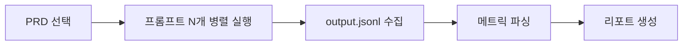

# 프롬프트 벤치마크

<a href="https://github.com/sdadaniel/prompt-benchmark" target="_blank" rel="noopener noreferrer" title="GitHub 저장소">github.com/sdadaniel/prompt-benchmark</a>

<a href="https://velog.io/@sdadaniel/%ED%94%84%EB%A1%AC%ED%94%84%ED%8A%B8-%EB%B6%84%EC%84%9D" target="_blank" rel="noopener noreferrer" title="블로그 포스트">상세 분석 결과 (블로그)</a>

## 1. 개요

AI 에이전트에 시스템 프롬프트를 어떻게 주느냐에 따라 비용·속도·코드 품질이 크게 달라진다. 하지만 "어떤 프롬프트가 좋은지"에 대한 답은 대부분 감이나 경험에 의존한다. 이 프로젝트는 **동일한 PRD를 여러 프롬프트로 병렬 실행**하고, 토큰·비용·실행 시간·코드 라인 수·코드 품질을 정량적으로 비교하는 **로컬 벤치마크 도구**다.

## 2. 문제

- 프롬프트 최적화가 **감**에 의존함 — 복잡한 프롬프트가 더 좋다는 근거 없는 가정
- 프롬프트 변경의 효과를 **정량적으로 측정**할 방법이 없음
- 오케스트레이터 패턴(태스크 분해 → 병렬 위임)이 실제로 효과적인지 검증 불가
- 프롬프트별 **비용 차이**를 사전에 예측할 수 없음

## 3. 해결방법

### 3-1. 벤치마크 프레임워크

동일한 PRD(요구사항 문서)를 **여러 프롬프트**로 병렬 실행하여 비교한다. 각 프롬프트는 격리된 디렉토리에서 독립 실행되며, 실행 후 자동으로 리포트를 생성한다.

### 3-2. 프롬프트 분류

| 유형 | 프롬프트 | 핵심 전략 |
|------|---------|-----------|
| **오케스트레이터** | prompt1, prompt4, prompt5 | 재귀적 태스크 분해, 하위 에이전트 위임 |
| **실용주의** | prompt6, prompt7, prompt8, prompt11 | 코드 먼저, 파일 수 최소화, 실행으로 검증 |
| **미니멀** | prompt2, prompt9, prompt10 | 최소 지시 ("잘 구현해줘" 3글자) |

### 3-3. 측정 항목

- **비용**: 토큰 사용량(input/output/cache), 달러 환산
- **속도**: 실행 시간(초), 턴 수
- **코드 품질**: 파일 수, LOC(코드 라인 수), 코드리뷰 점수(60점 만점)
- **효율**: LOC/$ (가성비), 캐시 적중률

## 4. 기술 스택

|  |  |
| --- | --- |
| **벤치마크 엔진** | `Bash`, `Claude Code CLI` |
| **리포트 생성** | `Node.js`, `HTML/CSS/JS` |
| **데이터** | `JSON` (stream-json 파싱) |
| **모델** | `claude-sonnet-4-6`, `claude-opus-4-6`, `claude-haiku-4-5` |

## 5. 개발

### 5-1. 실행 흐름

1. **PRD 선택** - `docs/prd/prd1.md`(URL 단축 서비스) 또는 `prd2.md`(실시간 채팅 앱)
2. **병렬 실행** - 각 프롬프트를 격리된 `prompt-result-code/promptN/` 디렉토리에서 동시 실행
3. **메트릭 수집** - `--output-format stream-json`으로 토큰·비용·턴 수를 실시간 추출
4. **리포트 생성** - `data.json`으로 집계 후 HTML 대시보드 자동 생성

### 5-2. 주요 기능

- **멀티 프롬프트 테스트** - 마크다운 파일로 프롬프트를 정의하고, 전체 또는 특정 프롬프트만 선택 실행
- **모델 선택** - sonnet, opus, haiku 중 선택 가능 (`bash scripts/start.sh --prd 2 --prompt 3 opus`)
- **격리 실행** - 각 프롬프트가 독립 디렉토리에서 실행되어 결과가 오염되지 않음
- **실시간 진행 표시** - 완료 시 비용·시간·턴 수를 즉시 출력
- **자동 HTML 리포트** - 탭 기반 대시보드(Overview, Comparison, PRD, Prompt Details)로 결과 시각화

## 6. 회고

### 6-1. 성과

- 11종 프롬프트, 2개 PRD, **17회 실행**으로 정량적 비교 데이터 확보
- "복잡한 프롬프트 = 좋은 결과" 가설을 **데이터로 반증**

### 6-2. 장점

- **재현 가능**: 동일 PRD, 다른 프롬프트, 측정 가능한 결과
- **병렬 실행**: 모든 프롬프트가 동시에 돌아 비교 조건이 균일
- **자동 리포트**: 실행 → 수집 → 시각화까지 원커맨드

### 6-3. 단점

- **코드리뷰 점수의 주관성**: 자동 채점이 아닌 수동 리뷰 기반이라 일관성 한계
- **PRD 의존성**: URL 단축/채팅 앱에 한정된 결과로, 다른 도메인에 일반화하기 어려움
- **모델 버전 의존**: Claude 모델 업데이트 시 결과가 달라질 수 있음

## 7. 실행화면

<!-- swiper -->

<!-- /swiper -->
