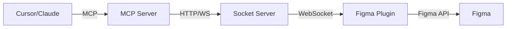
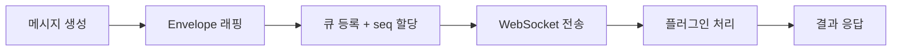
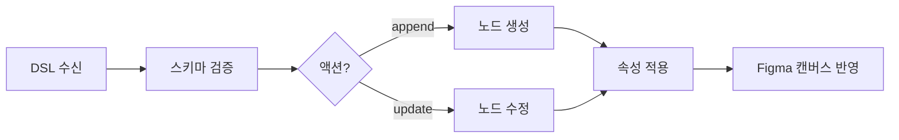
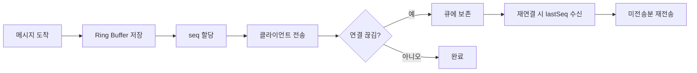

# 피그마 플러그인

<a href="https://github.com/sdadaniel/agent-bridge" target="_blank" rel="noopener noreferrer" title="GitHub 저장소">github.com/sdadaniel/agent-bridge</a>

## 1. 개요

AI 코딩 에이전트(Cursor/Claude)에서 자연어로 디자인을 지시하면, 그 결과가 Figma에 바로 반영되는 플러그인을 만들었다. MCP(Model Context Protocol)를 통해 에이전트와 통신하고, 자체 정의한 DSL(Design Specification Language)을 Figma API로 변환해 컴포넌트를 자동 생성·수정한다. 개발자가 Figma를 직접 조작하지 않아도, 코드를 쓰듯이 디자인을 만들 수 있는 환경을 목표로 했다.

## 2. 문제

- **Cursor·CLI에서 Figma 산출물까지**: 만든 이유는 **코딩 에이전트(Cursor/Claude)나 CLI로 지시한 결과가 그대로 Figma에 남는 것**—즉 실무에서 통용되는 **피그마 결과물**을 코드 작업 흐름 안에서 가져오기 위함이다.
- **Figma는 회사 운영의 필수 단계**: 디자인 검토·핸드오프·디자인 시스템 등 실제 조직에서는 Figma가 프로세스에서 빠지기 어렵다. 여기까지 자동화하지 않으면 AI로 개발을 밀어도 **디자인 산출 구간에서 다시 사람 손이 들어가** 이점이 반으로 줄어든다.
- **이 구간의 AI 자동화가 최대 목표**: 위 필수 단계를 **에이전트가 채워** 사람이 매번 Figma를 직접 조작하지 않도록 하는 것이 가장 큰 목적이다.

## 3. 해결방법

### 3-1. MCP 기반 에이전트 연동
  - **MCP(Model Context Protocol)** 표준을 구현해 Cursor/Claude가 Figma를 도구(tool)로 인식하게 함. 에이전트는 `send_dsl`, `get_context`, `list_clients` 세 가지 MCP 도구를 호출할 수 있음.
  - 에이전트가 **자연어 지시를 DSL로 변환**하고, MCP 도구를 통해 Figma에 전달하는 구조. 개발자는 채팅창에서 "빨간 버튼 만들어줘"라고 말하면 됨.

### 3-2. DSL(Design Specification Language)
  - Figma API를 직접 노출하는 대신, **JSON 기반의 선언적 DSL**을 정의함. 에이전트가 이해하기 쉽고, 검증·변환이 용이한 중간 언어 역할.
  - `append`(생성)와 `update`(수정) 두 가지 액션을 지원하며, `frame`, `rectangle`, `text`, `ellipse`, `component`, `polygon` 등의 요소 타입과 위치·크기·색상·레이아웃 등의 속성을 선언적으로 기술.
  - **Atomic Design** 체계(Atoms → Molecules → Organisms → Pages)를 따라 계층적으로 컴포넌트를 구성할 수 있음.

### 3-3. WebSocket 기반 실시간 통신
  - MCP Server → Socket Server → Figma Plugin 간 **WebSocket**으로 연결해, DSL 전송과 결과 반영이 실시간으로 이루어짐.
  - **생성뿐 아니라 수정을 위해 WebSocket을 둠.** MCP만으로 컴포넌트를 **만들기** 쪽은 가능해도, **어떤 노드를 고쳐야 하는지** 같은 정보는 Cursor가 플러그인·Figma 쪽에서 **역으로 받아오기 어렵다**. 수정용 DSL(`update`)을 쓰려면 대상 id·현재 상태 등이 에이전트에 와야 하는데, 일방향 구조에서는 그 데이터 경로가 끊긴다. 그래서 **플러그인 ↔ 서버 ↔ MCP** 사이에 **양방향** 채널을 열어, 필요한 컨텍스트와 명령이 오갈 수 있게 했다.
  

### 3-4. 컨텍스트 수집
  - `get_context` 도구로 Figma의 **현재 페이지 구조, 선택된 노드, 스타일, 레이아웃 정보**를 에이전트에 전달. 에이전트가 기존 디자인을 파악한 뒤 일관성 있는 결과를 생성할 수 있음.
  - 수집 깊이(depth)를 조절할 수 있고, 스타일·레이아웃 포함 여부도 옵션으로 제어.

## 4. 기술 스택

|  |  |
| --- | --- |
| **MCP Server** | `TypeScript`, `@modelcontextprotocol/sdk`, `Express`, `ws` |
| **Socket Server** | `Node.js`, `Express`, `ws`, `uuid` |
| **Figma Plugin** | `React`, `TypeScript`, `Figma Plugin API`, `Webpack` |
| **CLI (테스트용)** | `commander`, `TypeScript` |

## 5. 개발

### 5-1. 전체 아키텍처

에이전트의 자연어 지시가 DSL로 변환되어 MCP → Socket → Plugin을 거쳐 Figma 캔버스에 반영된다.

### 5-2. 메시지 프로토콜

모든 통신은 **MessageEnvelope** 구조로 래핑된다.

주요 메시지 타입:

| 타입 | 방향 | 의미 |
|------|------|------|
| `dsl.apply` | Server → Plugin | DSL 적용 요청 |
| `context.request` | Server → Plugin | 컨텍스트 수집 요청 |
| `context.response` | Plugin → Server | 컨텍스트 응답 |
| `register` / `registered` | 양방향 | 클라이언트 등록 |
| `ping` / `pong` | 양방향 | 연결 유지 |

### 5-3. MCP 도구

| 도구 | 기능 |
|------|------|
| `send_dsl` | DSL을 검증하고 Figma 플러그인에 전송. 대상 클라이언트·파일 지정 가능 |
| `get_context` | 현재 Figma 페이지 구조, 선택 노드, 스타일 정보를 수집해 반환 (10초 타임아웃) |
| `list_clients` | 연결된 Figma 플러그인 목록 조회 |

### 5-4. DSL 처리 흐름

- **append**: 새 요소를 생성하거나 기존 노드에 자식을 추가
- **update**: `nodeId`로 기존 노드를 찾아 속성을 수정
- 각 단계에서 검증을 거치며, scope 밖 변경은 차단

### 5-5. 메시지 큐와 재연결 복구

- 100개 슬롯의 Ring Buffer로 메모리 사용량을 제한하면서도 일시적 연결 끊김에 대응
- 클라이언트별 `lastSeq`를 추적해 정확히 누락된 메시지만 재전송

### 5-6. 주요 설계 결정

| 결정 | 이유 |
|------|------|
| MCP 표준 채택 | Cursor/Claude 등 MCP 지원 에이전트와 즉시 연동 가능, 벤더 종속 없음 |
| 중간 DSL 정의 | Figma API를 직접 노출하면 에이전트가 다루기 복잡. 선언적 DSL로 추상화해 에이전트 친화적으로 설계 |
| WebSocket + HTTP 이중 구조 | 실시간 통신(WebSocket)과 단발성 요청(HTTP)을 모두 지원 |
| Ring Buffer 메시지 큐 | 메모리 제한 + 재연결 복구를 동시에 해결 |
| Socket Server 분리 | MCP 없이도 독립 테스트 가능, CLI 도구로 직접 DSL 전송 가능 |
| Atomic Design 체계 | 디자인 시스템의 계층 구조를 DSL에 반영해 일관성 있는 컴포넌트 생성 |

## 6. 회고

### 6-1. 성과

- MCP 표준 기반으로 Cursor/Claude에서 **자연어 한 줄로 Figma 컴포넌트 생성**까지의 전체 파이프라인 구현
- DSL 정의 → 검증 → 변환 → 렌더링의 **4단계 처리 파이프라인**을 안정적으로 동작시킴

### 6-2. 장점

- **개발자 경험**: Figma를 몰라도 채팅으로 디자인을 만들 수 있음. 도구 전환 없이 에이전트 대화창에서 바로 작업.
- **MCP 표준 호환**: 특정 에이전트에 종속되지 않음. MCP를 지원하는 모든 도구에서 사용 가능.
- **Cursor·Claude만 있으면 무료로 쓸 수 있음**: MCP를 붙일 수 있는 **Cursor·Claude** 환경이면, Figma 전용 유료 SaaS 없이 **이 프로젝트의 MCP·Socket·플러그인을 직접 실행**해 동일 워크플로를 무료로 구성할 수 있음(에이전트·API 요금은 각 서비스 정책에 따름).
- **양방향 컨텍스트**: 에이전트가 Figma의 현재 상태를 읽을 수 있어, 기존 디자인과 일관성 있는 결과를 생성 가능.

### 6-3. 단점

- **에이전트 의존성**: DSL 품질이 에이전트의 이해도에 좌우됨. 복잡한 디자인 지시는 에이전트가 잘못된 DSL을 생성할 수 있고, 이를 사전에 완벽히 검증하기 어려움.
- **디자인 품질 한계**: 컴포넌트를 만들 수는 있지만, 디자인 품질 자체를 보장하지는 못한다. 별도의 하네스(룰셋·검증 레이어) 세팅으로 보완이 가능하다.

## 7. 실행영상

<video src="/ai/figma-plugin/figma-plugin.mp4" controls style="width:100%;max-width:800px;display:block;margin:0 auto" />
